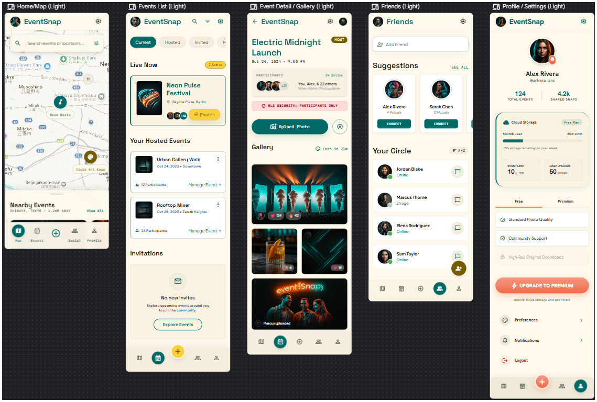

# EventSnap

Application mobile collaborative de gestion de sorties entre amis. EventSnap permet de créer des événements géolocalisés, d'inviter des participants, de centraliser le partage de photos et d'interagir via des réactions instantanées.

**Besoin métier :** centraliser les souvenirs de sorties éphémères dans une interface sociale sécurisée et intuitive.

---

## Table des matières

- [Maquette UI](#maquette-ui)
- [Charte graphique](#charte-graphique)
- [Fonctionnalités](#fonctionnalités)
- [Stack technique](#stack-technique)
- [Architecture & navigation](#architecture--navigation)
- [Modèle de données](#modèle-de-données)
- [Sécurité & RLS](#sécurité--rls)
- [Modèle freemium](#modèle-freemium)
- [Écrans & parcours utilisateur](#écrans--parcours-utilisateur)
- [Structure du projet](#structure-du-projet)
- [Prérequis & installation](#prérequis--installation)
- [Variables d'environnement](#variables-denvironnement)
- [Roadmap](#roadmap)
- [Équipe](#équipe)

---

## Maquette UI

Maquette haute fidélité des 5 écrans principaux (voir [`Maquette.png`](Maquette.png)) :



| Écran | Rôle |
|-------|------|
| **Map (Home)** | Découverte géolocalisée des sorties à proximité |
| **Events** | Liste filtrée des événements (en cours, hébergés, invités, passés) |
| **Détail / Galerie** | Vue d'une sortie, participants, upload et galerie live |
| **Social** | Ajout d'amis, suggestions et cercle social |
| **Profil** | Compte, stockage cloud, plan Free/Premium, paramètres |

La barre de navigation inférieure comporte **5 onglets** : Map, Events, **+** (création), Social, Profile.

---

## Charte graphique

| Élément | Valeur |
|---------|--------|
| **Thème** | Light Mode |
| **Fond** | Crème / off-white |
| **Couleur primaire** | Vert foncé / teal (boutons, accents) |
| **Couleur secondaire** | Orange / pêche (CTA Premium, FAB création) |
| **Formes** | Coins arrondis sur cartes, boutons et images |
| **Typographie** | Sans-serif moderne, titres en gras |

---

## Fonctionnalités

| Domaine | Description |
|---------|-------------|
| **Découverte** | Carte interactive + liste d'événements avec filtres (Current, Hosted, Invited, Past) |
| **Événements live** | Section « Live Now » pour les sorties actives en temps réel |
| **Galerie live** | Photos partagées par événement avec compte à rebours (TTL) |
| **Sécurité** | Bandeau RLS — accès réservé aux participants de la room |
| **Rôles** | Host, Admin, Photographer, Participant |
| **Social** | Suggestions d'amis, cercle (« Your Circle »), statut en ligne |
| **Photos** | Upload caméra/galerie, attribution par auteur |
| **Réactions** | Réactions emoji en temps réel (❤️, 😂, 🔥, 🙌) |
| **Freemium** | Plans Free / Premium avec quotas stockage et uploads |
| **Profil** | Statistiques, stockage cloud, préférences, déconnexion |

---

## Stack technique

| Couche | Technologie |
|--------|-------------|
| Framework | [Expo](https://expo.dev/) (SDK récent) |
| Navigation | [Expo Router](https://docs.expo.dev/router/introduction/) — onglets + piles (stack) |
| Backend | [Supabase](https://supabase.com/) — Auth, PostgreSQL, Storage, Realtime |
| Langage | TypeScript |
| Carte | `react-native-maps` + géolocalisation (`expo-location`) |
| Médias | `expo-image-picker`, `expo-camera` |
| Notifications | `expo-notifications` |

### Contraintes obligatoires (cahier des charges)

- Authentification réelle avec session persistée (Supabase Auth).
- Minimum de **4 écrans** distincts avec navigation structurée.
- Base de données distante avec **RLS** activées sur toutes les tables sensibles.
- Gestion explicite des états **loading**, **error** et **empty** sur chaque écran de données.
- Utilisation des APIs natives : géolocalisation, caméra/galerie, notifications.

---

## Architecture & navigation

```
app/
├── (auth)/                  # Écrans non authentifiés (login, register)
├── (tabs)/                  # Navigation principale (5 onglets)
│   ├── index.tsx            # Map (Home)
│   ├── events.tsx           # Liste des événements (filtres)
│   ├── create.tsx           # Création (+ FAB central)
│   ├── social.tsx           # Amis & cercle social
│   └── profile.tsx          # Profil & paramètres
└── event/
    └── [id].tsx             # Détail sortie (galerie live, upload)
```

**Schéma de navigation :**

```
[Tab Bar — 5 onglets]
 ├── Map ──► Nearby Events (bottom sheet) ──► Détail sortie
 ├── Events ──► Filtres (Current / Hosted / Invited / Past) ──► Détail sortie
 ├── + (FAB) ──► Création d'événement
 ├── Social ──► Suggestions / Your Circle
 └── Profile ──► Paramètres / Upgrade Premium

Détail sortie ──► Upload Photo ──► Galerie live (compte à rebours TTL)
```

---

## Modèle de données

### Tables principales

#### `profiles` (Users)
Extension du profil Supabase Auth.

| Colonne | Type | Description |
|---------|------|-------------|
| `id` | `uuid` (PK, FK → `auth.users`) | Identifiant utilisateur |
| `username` | `text` | Nom d'affichage unique |
| `avatar_url` | `text` | URL de l'avatar |
| `plan` | `enum` | `free` \| `premium` |
| `storage_used_bytes` | `bigint` | Stockage consommé (jauge profil) |
| `created_at` | `timestamptz` | Date de création |

#### `events`
| Colonne | Type | Description |
|---------|------|-------------|
| `id` | `uuid` (PK) | Identifiant de l'événement |
| `name` | `text` | Nom de la sortie |
| `description` | `text` | Description optionnelle |
| `latitude` | `float` | Coordonnée GPS |
| `longitude` | `float` | Coordonnée GPS |
| `event_date` | `timestamptz` | Date de la sortie |
| `expires_at` | `timestamptz` | Fin de vie (TTL) |
| `host_id` | `uuid` (FK → `profiles`) | Créateur de l'événement |
| `created_at` | `timestamptz` | Date de création |

#### `members`
Table de jointure utilisateur ↔ événement avec rôle.

| Colonne | Type | Description |
|---------|------|-------------|
| `id` | `uuid` (PK) | Identifiant |
| `event_id` | `uuid` (FK → `events`) | Événement |
| `user_id` | `uuid` (FK → `profiles`) | Utilisateur |
| `role` | `enum` | `host` \| `admin` \| `photographer` \| `participant` |
| `joined_at` | `timestamptz` | Date d'adhésion |

#### `photos`
| Colonne | Type | Description |
|---------|------|-------------|
| `id` | `uuid` (PK) | Identifiant |
| `event_id` | `uuid` (FK → `events`) | Événement lié |
| `user_id` | `uuid` (FK → `profiles`) | Auteur de la photo |
| `storage_path` | `text` | Chemin dans Supabase Storage |
| `created_at` | `timestamptz` | Date d'upload |

#### `reactions`
| Colonne | Type | Description |
|---------|------|-------------|
| `id` | `uuid` (PK) | Identifiant |
| `photo_id` | `uuid` (FK → `photos`) | Photo ciblée |
| `user_id` | `uuid` (FK → `profiles`) | Utilisateur |
| `emoji` | `text` | ❤️, 😂, 🔥 ou 🙌 |
| `created_at` | `timestamptz` | Date de la réaction |

#### `friendships`
| Colonne | Type | Description |
|---------|------|-------------|
| `id` | `uuid` (PK) | Identifiant |
| `user_id` | `uuid` (FK → `profiles`) | Demandeur |
| `friend_id` | `uuid` (FK → `profiles`) | Ami cible |
| `status` | `enum` | `pending` \| `accepted` |
| `created_at` | `timestamptz` | Date de la demande |

### Rôles par événement

| Rôle | Droits |
|------|--------|
| **Host** | Créer l'événement, gérer les membres et rôles, supprimer des photos, gérer le TTL |
| **Admin** | Inviter des participants, modérer la galerie |
| **Photographer** | Upload prioritaire, attribution visible sur les photos |
| **Participant** | Voir l'événement, uploader (dans la limite freemium), réagir, télécharger |

---

## Sécurité & RLS

Toutes les tables applicatives ont **Row Level Security** activée. Principe général : un utilisateur n'accède qu'aux données des événements dont il est membre.

| Table | Politique (résumé) |
|-------|-------------------|
| `profiles` | Lecture publique des profils ; modification uniquement de son propre profil |
| `events` | Lecture si membre ; création par tout utilisateur authentifié ; modification/suppression réservée au host |
| `members` | Lecture si membre du même événement ; insertion par le host ou via invitation acceptée |
| `photos` | Lecture si membre de l'événement ; insertion par membre ; suppression par l'auteur ou le host |
| `reactions` | Lecture si membre ; insertion/suppression de ses propres réactions |
| `friendships` | Lecture si impliqué ; création par le demandeur ; mise à jour par le destinataire (acceptation) |

**Storage Supabase :** bucket `event-photos` avec politiques liées au `event_id` — seuls les membres peuvent lire/écrire dans le dossier de leur événement. L'usage stockage par utilisateur est agrégé pour la jauge du profil.

---

## Modèle freemium

Aligné sur l'écran Profil de la maquette :

| Limite | Plan Free | Plan Premium |
|--------|-----------|--------------|
| Stockage cloud | 2 Go (ex. 500 Mo utilisés) | 50 Go |
| Événements / mois | 10 | Illimité |
| Uploads / jour | 50 snaps | Illimité |
| Qualité photo | Standard | Haute résolution + filtres pro |
| Durée de vie événement (TTL) | Compte à rebours court (ex. 21 min en live) | TTL étendu |

Le profil affiche une jauge de stockage, un toggle Free/Premium et un CTA « Upgrade to Premium ». Le statut est stocké dans `profiles.plan` et vérifié côté client (UX) et serveur (RLS / fonctions Postgres).

---

## Écrans & parcours utilisateur

### 1. Map — Home
- **Header** : avatar profil, logo EventSnap, icône paramètres.
- **Recherche** : barre « Search events or locations… » + filtre.
- **Carte** : vue interactive avec marqueurs par type d'événement.
- **Bottom sheet** : carte « Nearby Events » (lieu, distance) + lien « View All ».
- **Navigation** : onglet Map actif.

### 2. Events — Liste
- **Filtres** (chips) : `Current` · `Hosted` · `Invited` · `Past`.
- **Live Now** : événements actifs (badge « X Active »), accès rapide aux photos.
- **Your Hosted Events** : sorties organisées, nombre de participants, lien « Manage Event ».
- **Invitations** : état vide avec CTA « Explore Events » si aucune invite.
- **FAB** : bouton **+** jaune/orange centré dans la tab bar → création d'événement.

### 3. Détail sortie — Galerie live
- **En-tête** : nom, date/heure, badge **HOST**.
- **Participants** : avatars, compteur « X Online », rôles (Admin, Photographer…).
- **Sécurité** : bandeau « RLS SECURITY : PARTICIPANTS ONLY ».
- **Action** : bouton principal « Upload Photo » (teal).
- **Galerie** : grille live avec attribution auteur, compte à rebours (« Ends in 21m »).

### 4. Social — Amis
- **Recherche** : champ « Add Friend ».
- **Suggestions** : carrousel horizontal (amis en commun, bouton « Connect »).
- **Your Circle** : liste alphabétique, statut en ligne (« Online », « 2h ago »), messagerie rapide.
- **FAB** : ajout de contacts / groupe.

### 5. Profil — Paramètres
- **Identité** : photo, nom, @handle, stats (Total Events, Shared Snaps).
- **Cloud Storage** : jauge d'usage, plan actuel, limites (événements/mois, snaps/jour).
- **Abonnement** : toggle Free / Premium, liste des avantages, CTA « Upgrade to Premium ».
- **Menu** : Preferences, Notifications, Logout (rouge).

---

## Structure du projet

```
dev_mobile/
├── app/                    # Routes Expo Router
├── components/             # Composants réutilisables (UI, carte, galerie…)
├── hooks/                  # Hooks custom (auth, géoloc, upload…)
├── lib/                    # Client Supabase, helpers, constantes
├── types/                  # Types TypeScript (DB, navigation)
├── assets/                 # Images, icônes, fonts
├── Maquette.png            # Maquette UI (référence design)
├── supabase/
│   ├── migrations/         # Scripts SQL (tables, RLS, fonctions)
│   └── seed.sql            # Données de test
├── .env.example            # Variables d'environnement (modèle)
├── app.json                # Configuration Expo
├── package.json
└── README.md
```

---

## Prérequis & installation

### Prérequis

- [Node.js](https://nodejs.org/) ≥ 18
- [npm](https://www.npmjs.com/) ou [yarn](https://yarnpkg.com/)
- [Expo CLI](https://docs.expo.dev/get-started/installation/) (`npx expo`)
- Compte [Supabase](https://supabase.com/) (projet créé)
- [Expo Go](https://expo.dev/go) sur mobile ou émulateur Android/iOS

### Installation

```bash
# Cloner le dépôt
git clone <url-du-repo>
cd dev_mobile

# Installer les dépendances
npm install

# Copier et renseigner les variables d'environnement
cp .env.example .env

# Lancer l'application
npx expo start
```

### Commandes utiles

```bash
npx expo start          # Serveur de développement
npx expo start --ios    # Simulateur iOS
npx expo start --android # Émulateur Android
npx tsc --noEmit        # Vérification TypeScript
```

---

## Variables d'environnement

Créer un fichier `.env` à la racine (ne jamais le committer) :

```env
EXPO_PUBLIC_SUPABASE_URL=https://<project>.supabase.co
EXPO_PUBLIC_SUPABASE_ANON_KEY=<your-anon-key>
```

> Les clés `service_role` ne doivent **jamais** être exposées côté client.

---

## Roadmap

### Phase 1 — Initialisation
- [ ] Constitution de l'équipe et répartition des rôles
- [ ] Choix de l'architecture et conventions de code
- [ ] Initialisation du dépôt Git et du projet Expo

### Phase 2 — Backend
- [ ] Configuration du projet Supabase
- [ ] Création des tables et relations
- [ ] Activation et test des politiques RLS
- [ ] Configuration du bucket Storage

### Phase 3 — UI & Navigation
- [ ] Mise en place d'Expo Router (5 onglets + Stack)
- [ ] Implémentation de la charte graphique (voir [Maquette.png](Maquette.png))
- [ ] Écrans squelettes avec gestion loading / error / empty
- [ ] Composants réutilisables (cartes, bottom sheet, FAB, chips filtres)

### Phase 4 — Fonctionnalités
- [ ] Authentification (inscription, connexion, session persistée)
- [ ] Carte interactive et géolocalisation
- [ ] CRUD événements (création via FAB, liste avec filtres, détail)
- [ ] Section Live Now + compte à rebours TTL sur la galerie
- [ ] Système d'invitations, amitiés et gestion des rôles (Host, Admin, Photographer)
- [ ] Upload de photos (caméra + galerie)
- [ ] Réactions emoji en temps réel (Supabase Realtime)
- [ ] Notifications push

### Phase 5 — Polissage
- [ ] Gestion fine des états loading / error / empty
- [ ] Tests de sécurité (tentatives d'accès non autorisé)
- [ ] Optimisation des performances (images, cache)
- [ ] Revue UX et corrections finales

---

## Équipe

| Membre | Rôle |
|--------|------|
| _Lucas_ | _Dev_ |
| _Mathieu_ | _Dev_ |

---

## Licence

Projet académique — B3 Informatique, module Développement Mobile.
